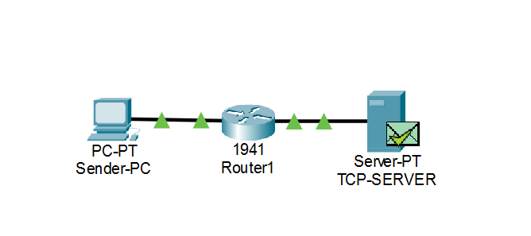

# TCP Flow Control Simulator

## Project Overview

This project demonstrates TCP flow control using a sliding-window mechanism and receiver-window management.

The project combines Cisco Packet Tracer for observing TCP communication and a Python GUI simulator for demonstrating sliding-window behavior.

## Objectives

- Understand TCP flow control.
- Demonstrate sliding-window behavior.
- Understand sequence numbers and acknowledgements.
- Observe TCP advertised receive-window values.
- Demonstrate receiver-window management using Python.
- Visualize packet transmission and ACKs through a GUI.

## Technologies Used

- Cisco Packet Tracer
- Python
- Tkinter
- TCP/IP
- HTML/HTTP for connectivity testing

## Project Architecture

Sender-PC → Router1 → TCP-SERVER

The Cisco Packet Tracer network is used to observe TCP packets, sequence numbers, acknowledgements and advertised window values.

The Python application provides a visual simulation of the sliding-window mechanism.

## Cisco Packet Tracer

The Packet Tracer implementation contains:

- Sender PC
- Router1
- TCP Server
- IP configuration
- TCP communication
- HTTP connectivity
- TCP Simulation Mode

### Observed TCP Values

| Sequence | ACK | Advertised Window |
|---:|---:|---:|
| 0 | 0 | 65535 |
| 0 | 1 | 16384 |
| 1 | 1 | 65535 |
| 102 | 472 | 65535 |
| 472 | 103 | 15913 |

These values were observed from TCP PDU information in Cisco Packet Tracer.

## Python Sliding Window Simulator

The Python simulator demonstrates:

1. Sender window
2. Packet transmission
3. Receiver acknowledgement
4. Window sliding
5. Receiver-window management

Example:

Sender Window:

1 2 3 4

After ACK:

5 6 7 8

Then:

9 10 11 12

## Screenshots

### Network Topology



### TCP Simulation


### Python GUI Simulator


### python TCP simulator1


## How to Run

Open Command Prompt inside the project folder and run:

```bash
python tcp_sliding_window.py


## How to Run

Open Command Prompt inside the project folder and run:

```bash
python tcp_sliding_window.py
